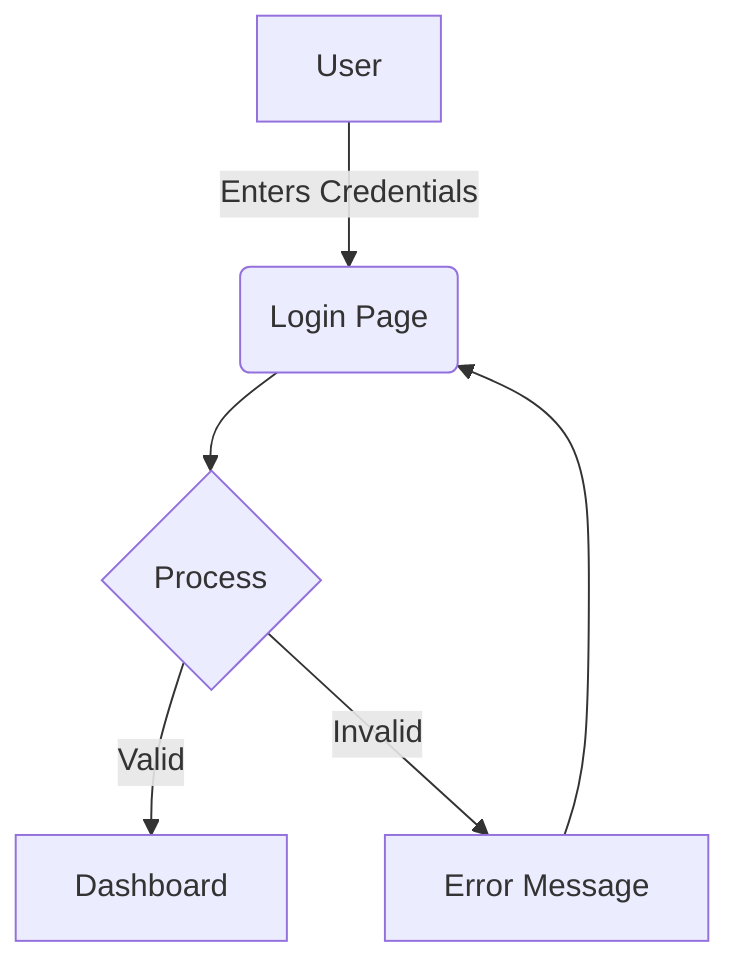
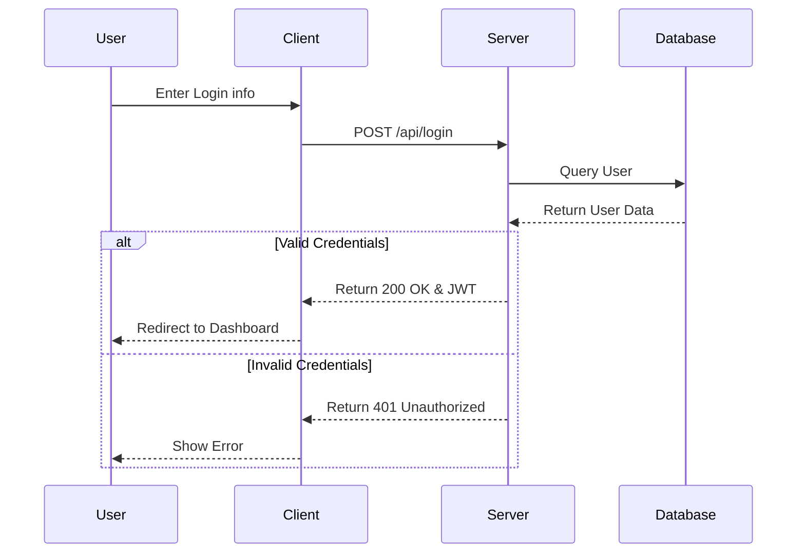
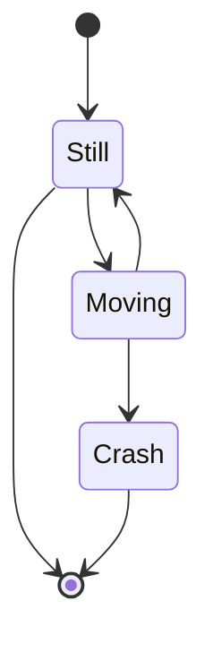

# Mermaid Diagrams 📊

Thanks to the power of `mermaid.js`, you can natively render beautiful diagrams right inside your markdown documents.

## Flowchart

A simple flowchart detailing a standard login sequence.

## Sequence Diagram

A sequence diagram showing authentication.

## State Diagram

## Styling Notes

The charts automatically inherit the base neumorphic colors as configured in `app.js` using Mermaid's theme variables. 
