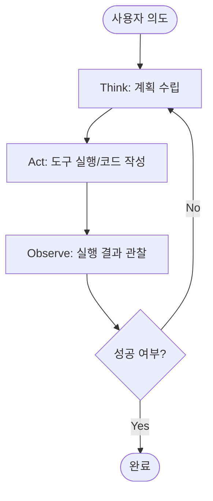
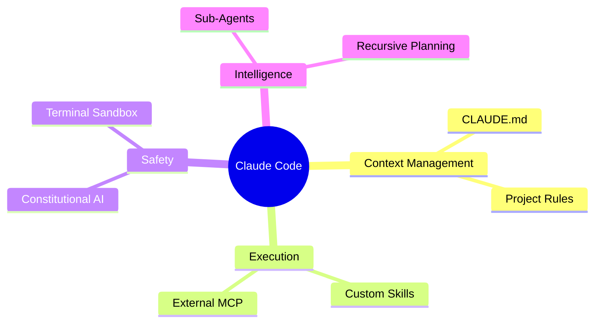
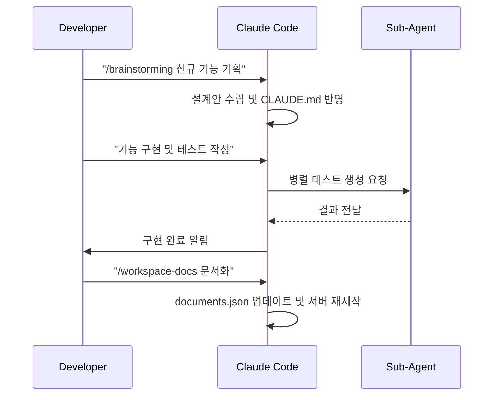

# Claude Code 마스터 클래스: AI 시대의 새로운 개발 패러다임 🎓

> **Soft Neumorphism & Playful Fun** 스타일의 세미나 통합 가이드

본 문서는 Anthropic의 터미널 기반 AI 개발 에이전트인 **Claude Code**의 핵심 기능 분석과 사내 세미나(생산성 향상을 위한 스킬 활용) 내용을 병합하여 총 24장의 슬라이드 분량으로 재구성한 강의 자료입니다.

---

## Part 0: 인트로 (Coding Evolution)

### 0.1 개발 패러다임의 변화 (Slide 1-2)
과거의 단순한 코드 보조 도구에서, 스스로 생각하고 실행하는 에이전트 시대로의 전환을 다룹니다.

| 단계 | 명칭 | 주요 특징 |
| :--- | :--- | :--- |
| **Phase 1** | Autocomplete | 단순히 다음 단어를 예측하는 수준 (IDE 기본 기능) |
| **Phase 2** | Copilot | 함수 단위의 코드를 제안하고 채팅 인터페이스 제공 |
| **Phase 3** | **AI Agent** | **Claude Code.** 스스로 계획(Think)하고 도구를 사용(Act)하며 관찰(Observe)함 |

---

## Part 1: Claude Code 소개 (Overview)

### 1.1 Terminal Based Agent (Slide 3)
Claude Code는 터미널에서 직접 파일 시스템을 제어하며 개발자와 협업합니다.

### 1.2 핵심 기능 카드 (Slide 4)
| 기능 | 활용 시나리오 |
| :--- | :--- |
| **테스트/개발** | 복잡한 레거시 코드에 대한 유닛 테스트 자동 생성 및 리팩토링 |
| **개발(Implementation)** | 새로운 기능의 보일러플레이트 작성 및 의존성 해결 |
| **PR 생성** | Git diff를 분석하여 논리적인 PR 문서와 커밋 메시지 작성 |
| **MCP 연동** | GitHub, Slack, DB 등 외부 시스템과의 연결 허브 역할 |
| **에이전트 제어** | 자율적인 문제 해결 능력을 갖춘 서브 에이전트 가동 |
| **스케줄링** | 정기적인 코드 시큐리티 스캔 및 아키텍처 인지 상태 유지 |

---

## Part 2: Deep Dive (Technical Hub) ⭐

### 2.1 아키텍처 구조 맵 (Slide 5)
Claude Code를 중심으로 한 7가지 주요 요소의 연결 구조입니다.

### 2.2 프로젝트 기억 장치: CLAUDE.md (Slide 6)
프로젝트의 맥락을 잃지 않기 위해 3단계 경로별로 기억을 저장합니다.
1. **Global**: 사용자 전체 설정
2. **Project-level**: 해당 프로젝트의 기술 스택 및 컨벤션
3. **Personal**: 현재 작업자의 특수한 요구사항

### 2.3 핵심 Rules 4가지 & 로깅 패턴 (Slide 7)
에이전트의 효율적인 동작을 위한 룰셋과 직관적인 로깅 시스템입니다.

| 핵심 Rule | 내용 |
| :--- | :--- |
| **Language Rule** | 프로젝트의 기술 스택(Typescript, Python 등) 엄수 |
| **Planning Rule** | 무작정 코딩하지 않고 `/brainstorming`을 통한 선 설계 |
| **Agents Rule** | 복잡한 작업은 서브 에이전트에게 위임하는 기준 |
| **Web-fetch Rule** | 부족한 지식은 실시간 검색을 통해 보완하는 우선순위 |

**[Logging Icons]**
- 🤖 : 에이전트가 사고 중 (Thinking)
- ⚡ : 고속 도구 실행 (Fast Act)
- ✅ : 작업 성공 (Success)
- ❌ : 에러 발생 및 핸들링 (Error)

### 2.4 Skills 철학 (Slide 8)
- **제작 시점**: 3번 이상 같은 질문이나 명령을 반복할 때.
- **Progressive Disclosure**: 핵심 정보만 먼저 노출하고, 상세 내용은 필요시 공개.
- **SKILL.md**: 500자 이하의 명확하고 간결한 지침 작성.

### 2.5 MCP & Research 도구 (Slide 9-10)
- **핵심 도구**: `deep-research` (심층 조사), `web-fetch` (웹 데이터 추출), `github-search` (코드 검색)
- **에이전트 작동 원리**: 메인 컨텍스트를 보호하기 위해 서브 에이전트에게 특정 범위를 할당하고 결과를 수렴하는 병렬 처리 아키텍처.

---

## Part 3: 실전 개발 워크플로우 시연 🛠️

### 3.1 시나리오 파이프라인 (Slide 12-16)

### 3.2 단계별 핵심 액션 (Workspace-docs 병합)
1. **Plan**: `brainstorming` 스킬을 통한 아키텍처 설계
2. **Develop**: TDD 가이드라인에 따른 코드 작성 및 MCP 기반 도구 로드
3. **Documentation**: 3가지 타입의 강력한 문서화 지원
    - `dev`: 개발자용 기술 명세
    - `summary`: 프로젝트 개요 및 히스토리
    - `research`: 외부 리서치 결과물 정리
4. **Resume**: 작업 중단 후 `/resume` 명령어로 이전 상태(Handoff)를 완벽히 복원

---

## Part 4: 꿀팁 & 실습 & 마무리 💡

### 4.1 도구 비교 (Slide 19)
| 구분 | Claude Code | GitHub Copilot | Cursor |
| :--- | :--- | :--- | :--- |
| **인터페이스** | **Terminal (CLI)** | Chat / Inline UI | **IDE (Forked VSCode)** |
| **자율성** | **High** (Agentic) | Medium (Assistive) | High (Integrated) |
| **강점** | 터미널 명령 및 도구 실행 능력이 매우 탁월 | 코드 제안 속도와 범용성 | IDE 내에서의 심리스한 UI 경험 |

### 4.2 Hands-on 실습 Lab (Slide 20-23)
- **Lab 1 (기획)**: `/pptx` 스킬과 커넥터를 활용한 PPT 자동 생성 실습
- **Lab 2 (프론트)**: `/ui-ux-pro-max` 스킬을 활용한 고퀄리티 프론트엔드 설계
- **Lab 3 (리서치)**: `deep-research`를 활용한 최신 기술 트렌드 분석 및 자동 문서화
- **Lab 4 (풀사이클)**: 기획 -> 구현 -> TDD -> 문서화 -> 배포 공유 풀사이클 실습

### 4.3 마무리 (Slide 24)
- **Q&A**: 세미나 질의응답 및 피드백
- **Resource**: 개별 최적화된 SPICA 스킬 저장소 및 활용 가이드 배포

---

> **Thank you!**
> "최선의 코딩은 코드를 적게 쓰는 것이 아니라, AI가 정확하게 쓰도록 만드는 것입니다." - Chanhee Workspace

---
*본 문서는 24장의 마스터 PPT 기획안에 따라 구성되었습니다.*
