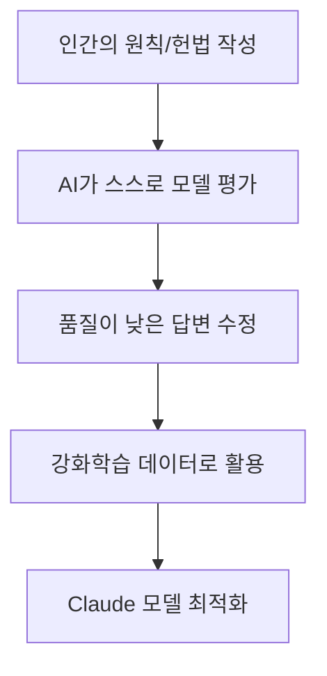
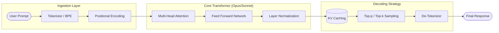
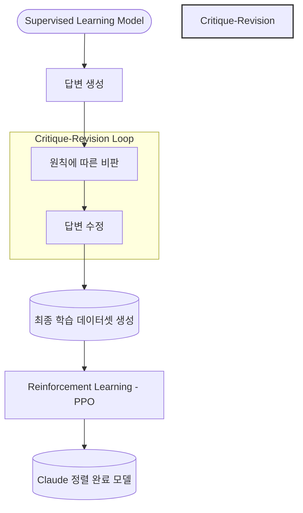
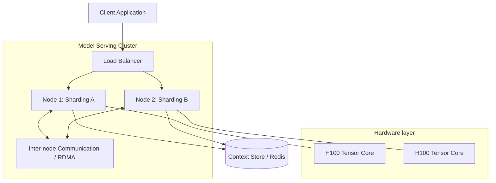

# Claude 기술 가이드: Anthropic의 차세대 AI 🤖

**Claude**는 Anthropic에서 개발한 대규모 언어 모델(LLM) 제품군으로, 안전성과 성능의 균형을 맞춘 **Constitutional AI** 기술을 기반으로 합니다. 이 문서에서는 Claude의 핵심 기술적 특징과 아키텍처를 소개합니다.

---

## 1. 핵심 기술 아키텍처

Claude는 기존의 RLHF(Transformer 기반 강화학습)를 넘어선 독자적인 학습 방식을 사용합니다.

### 1.1 Constitutional AI
Claude의 가장 큰 차별점은 모델이 따를 수 있는 '헌법(Constitution)'을 부여하고, 이를 기반으로 스스로의 답변을 평가하고 수정하도록 학습시키는 것입니다.



---

## 2. 모델 라인업 비교

Claude 3 및 3.5 모델 제품군은 속도와 지능에 따라 세 가지로 나뉩니다.

| 모델명 | 특징 | 주요 용도 | 지능 지수 |
|--------|------|----------|-----------|
| **Haiku** | 초고속, 경량화 | 실시간 챗봇, 단순 자동화 | ⚡ Fast |
| **Sonnet** | 속도와 지능의 균형 | 데이터 분석, 복잡한 태스크 | 🏆 Balanced |
| **Opus** | 최상위 지능 | 연구, 법률 분석, 전략 기획 | 🧠 Premium |

---

## 3. 기술적 이점

### 3.1 컨텍스트 윈도우 (Context Window)
Claude는 업계 최고 수준인 **200K 이상의 토큰** 컨텍스트 윈도우를 지원합니다. 이는 책 수 권 분량의 데이터를 한 번에 처리할 수 있음을 의미합니다.

### 3.2 Artifacts 및 실시간 코딩
Claude 3.5 Sonnet은 단순 텍스트 답변을 넘어, 코드 실시간 실행 및 UI 렌더링을 지원하는 **Artifacts** 기능을 도입했습니다.

```javascript
// Claude는 코드 추론 능력이 매우 뛰어납니다.
function analyzeImpact(context) {
  const complexity = context.length;
  if (complexity > 100000) {
    return "High Cognitive Load";
  }
  return "Efficient Processing";
}
```

---

## 4. 상세 기술 아키텍처 및 데이터 흐름

### 4.1 인퍼런스 파이프라인 (Inference Pipeline)
Claude의 태스크 처리 과정은 단순한 입출력을 넘어 복잡한 최적화 레이어를 거칩니다.



### 4.2 Constitutional AI 학습 메커니즘 (Double-Loop Training)
Claude는 자가 비판(Self-Critique)과 자가 수정(Self-Revision)이라는 두 단계를 통해 더욱 안전하게 학습됩니다.



### 4.3 인프라 아키텍처 (Scaled System Design)
엔터프라이즈 환경에서의 Claude 배포 구조는 모델 샤딩과 로드 밸런싱이 핵심입니다.



---

## 5. 결론

Claude는 단순한 대화형 AI를 넘어, 모델의 행동 지침을 명확히 함으로써 **신뢰할 수 있는 협업 파트너**를 지향합니다. 특히 한국어 지원 성능이 비약적으로 향상되어 한국 개발 생태계에서도 강력한 도구로 자리잡고 있습니다.

> "Claude는 지능은 높게, 유해성은 낮게 유지하는 것을 최우선 가치로 합니다." - Anthropic Engineering Team
