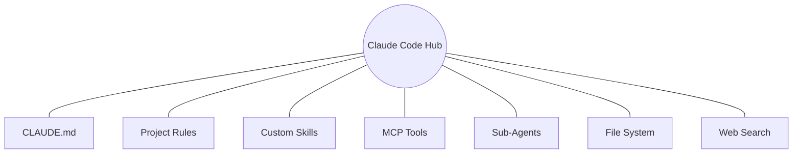
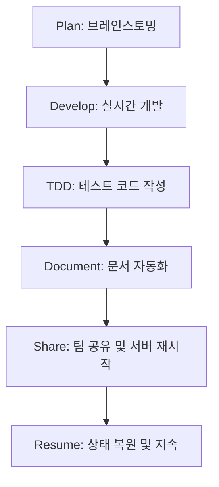

# Claude Code 마스터 클래스: AI 시대의 새로운 개발 패러다임 🎓

본 강의는 Anthropic의 터미널 기반 AI 개발 에이전트인 **Claude Code**를 활용하여 개발 생산성을 극대화하는 방법을 다룹니다. 소프트 뉴모피즘 디자인 철학을 반영한 현대적인 세미나 내용을 담고 있습니다.

---

## Part 1. Claude Code 소개

### 1.1 코딩의 진화 과정
코딩 방식은 단순 자동 완성에서 인간의 의도를 이해하고 실행하는 '에이전트' 시대로 변화하고 있습니다.

### 1.2 핵심 기능 6가지
Claude Code는 단순한 챗봇이 아닌, 파일 시스템과 도구에 접근할 수 있는 강력한 에이전트입니다.

| 기능 | 설명 |
|------|------|
| **테스트/개발** | 코드 작성에서 유닛 테스트 생성까지 자동화 |
| **PR 생성** | 변경 사항 분석 및 Pull Request 문서 자동화 |
| **MCP 연동** | Model Context Protocol을 통한 외부 도구 확장 |
| **에이전트 실행** | 서브 에이전트를 통한 복잡한 태스크 병렬 처리 |
| **스케줄링** | 정기적인 코드 리뷰 및 분석 스케줄링 |
| **리서치** | `deep-research` 기능을 통한 기술 스택 분석 |

---

## Part 2. 기술적 Deep Dive ⭐

### 2.1 아키텍처 개요
Claude Code는 중앙의 허브 시스템을 중심으로 다양한 외부 연동 요소를 제어합니다.

### 2.2 핵심 가이드 및 규칙 (Rules)
프로젝트별 고유한 룰을 설정하여 에이전트의 행동을 제어할 수 있습니다.

| 카테고리 | 핵심 규칙 | 로깅 패턴 |
|---------|----------|----------|
| **Language** | 프로젝트 주 언어 규정 | ⚡ Fast Execution |
| **Planning** | 구현 전 사전 설계 강제 | 🤖 Strategic Thinking |
| **Agents** | 서브 에이전트 위임 기준 | ✅ Task Completed |
| **Fallback** | 웹 검색 리서치 기준 | ❌ Error Handler |

---

## Part 3. 실전 개발 워크플로우 시연 🛠️

실습 시나리오를 통해 전체 개발 주기를 경험해 봅니다.

### 3.1 단계별 핵심 명령어 및 기능
1. **Plan**: `/superpowers:brainstorming`으로 초기 기획 및 아키텍처 수립
2. **Develop**: 커스텀 스킬을 로드하여 생산성 향상
3. **Document**: `/workspace-docs` 명령어로 `dev`, `summary`, `research` 타입의 문서 자동 생성

---

## Part 4. 실습 프로젝트 (Hands-on) 🧪

### 실습 1. 프론트엔드 설계 및 구현
- 사용 도구: `/superpowers:brainstorming`, `/ui-ux-pro-max`
- 내용: 소프트 뉴모피즘 스타일의 UI 구현 및 테일윈드 설정 자동화

### 실습 2. 리서치 & 스킬 제작
- 사용 도구: `deep-research`, `skill-creator`
- 내용: 새로운 라이브러리를 조사하고 이를 활용하기 위한 커스텀 스킬 개발

---

## 5. 결론 및 향후 전망

Claude Code는 단순한 도구가 아니라 **개발자의 사고 과정을 증폭시키는 지능형 조력자**입니다. `Think -> Act -> Observe -> Repeat` 루프를 통해 더욱 정교한 소프트웨어를 더 빠르게 구축할 수 있습니다.

> **Tip**: 3번 이상 반복되는 작업이 있다면 반드시 **SKILL.md**로 만들어 스킬화하세요!

---

*본 강의 문서는 Chanhee Workspace의 Markdown Reader를 위해 최적화되었습니다.*
